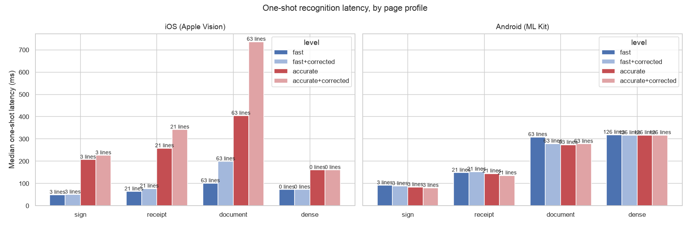

# One-shot recognition on device

How long `TextSight.recognizeImage` takes on real hardware, by page profile and recognition level.

> **Scope.** One-shot API latency as an app sees it: image decode, ML inference, the native encode and the channel hop, all inside one number. Inference dominates, but this does not isolate it. Live-camera throughput is a different measurement and not covered here.

Captured: SDK `3.13.2` · package `0.2.0` · git `bef2acd` · N=3 · 2026-09-03T08:34:12.303439Z. Measured on iOS and Android, so your hardware will differ.

- `level` is a no-op on Android, so its two rows should land on top of each other.
- Read **lines** beside the latency. A level that recognizes nothing returns fast, which would otherwise look like a win.
- Pages are rendered on-device at a fixed size, so decode cost is constant across profiles and the differences come from text density.

## iOS (Apple Vision)

| Profile | Level | Lines | p50 (ms) | p95 (ms) |
|---|---|--:|--:|--:|
| sign | `fast` | 3 | 49.0 | 52.3 |
| sign | `accurate` | 3 | 197.1 | 200.7 |
| receipt | `fast` | 15 | 63.4 | 63.5 |
| receipt | `accurate` | 21 | 310.3 | 311.7 |
| document | `fast` | 0 *(read nothing)* | 87.7 | 88.3 |
| document | `accurate` | 62 | 719.8 | 726.0 |
| dense | `fast` | 0 *(read nothing)* | 72.1 | 73.5 |
| dense | `accurate` | 0 *(read nothing)* | 157.6 | 160.0 |

## Android (ML Kit)

| Profile | Level | Lines | p50 (ms) | p95 (ms) |
|---|---|--:|--:|--:|
| sign | `fast` | 3 | 81.9 | 92.7 |
| sign | `accurate` | 3 | 80.8 | 97.1 |
| receipt | `fast` | 21 | 152.0 | 155.1 |
| receipt | `accurate` | 21 | 149.4 | 152.7 |
| document | `fast` | 63 | 341.0 | 343.4 |
| document | `accurate` | 63 | 273.1 | 303.1 |
| dense | `fast` | 126 | 328.7 | 333.2 |
| dense | `accurate` | 126 | 316.4 | 339.0 |

