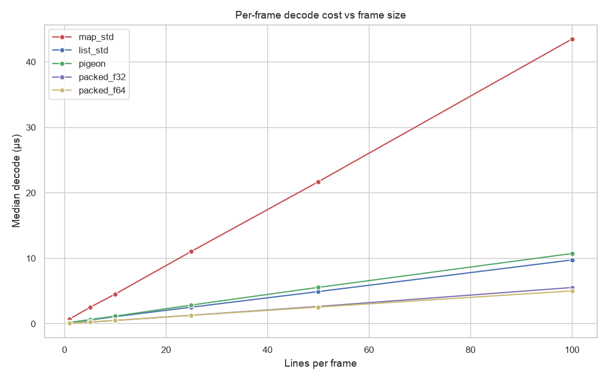
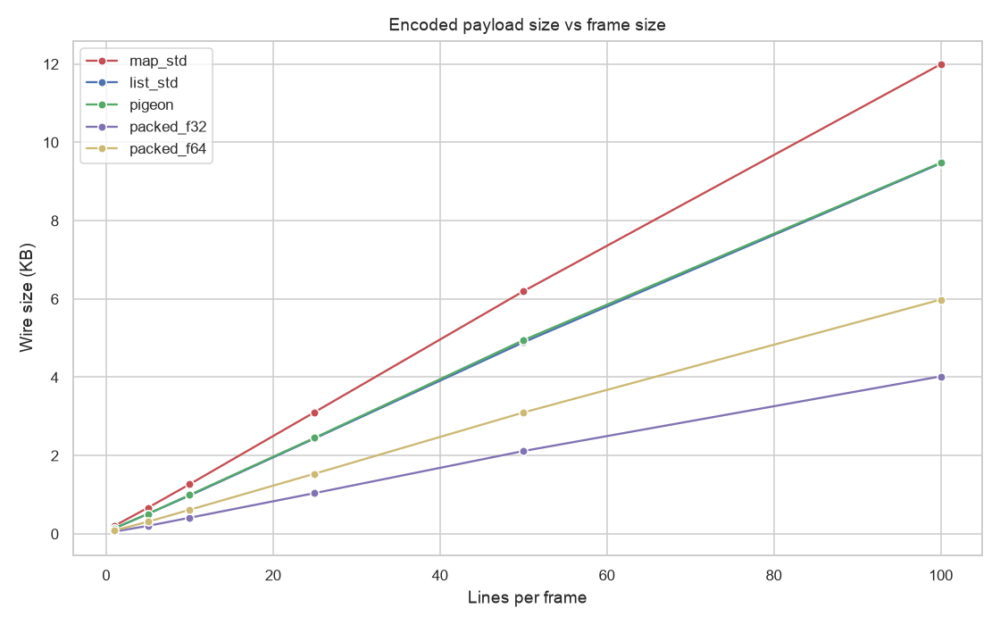
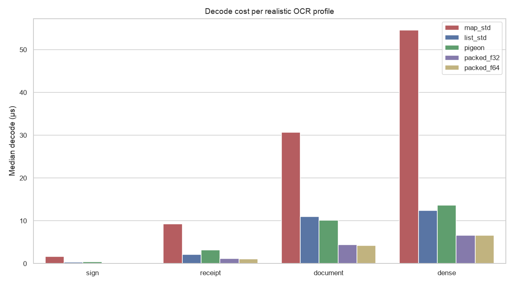

# Codec round-trip — state of performance

Per-frame **decode** CPU and **wire size** of the recognition-results transport, by candidate encoding. Decode is what runs on the Dart UI isolate per delivered frame; `map_std` is today's wire and the baseline.

> **Scope.** Pure-Dart codec cost only — *not* native encode, real-device frame latency, or ML inference (which dominates end-to-end). These numbers bound the upside of a transport change; they are not an end-to-end speedup.

Captured: SDK `3.12.2` · package `0.0.0` · git `af0885c` · N=1 · 2026-06-19T11:09:50.170716Z · per-machine — your numbers will differ.

## Realistic profiles

| Profile | Candidate | Decode (µs) | Wire (bytes) | Δ decode | Δ bytes |
|---|---|--:|--:|--:|--:|
| sign | `map_std` | 1.66 | 432 | 0% | 0% |
| sign | `list_std` | 0.36 | 312 | -79% | -28% |
| sign | `pigeon` | 0.40 | 312 | -76% | -28% |
| sign | `packed_f32` | 0.15 | 116 | -91% | -73% |
| sign | `packed_f64` | 0.16 | 184 | -91% | -57% |
| receipt | `map_std` | 9.30 | 2608 | 0% | 0% |
| receipt | `list_std` | 2.14 | 2016 | -77% | -23% |
| receipt | `pigeon` | 3.16 | 2024 | -66% | -22% |
| receipt | `packed_f32` | 1.13 | 852 | -88% | -67% |
| receipt | `packed_f64` | 1.08 | 1280 | -88% | -51% |
| document | `map_std` | 30.64 | 9384 | 0% | 0% |
| document | `list_std` | 10.99 | 7648 | -64% | -18% |
| document | `pigeon` | 10.10 | 7704 | -67% | -18% |
| document | `packed_f32` | 4.36 | 4149 | -86% | -56% |
| document | `packed_f64` | 4.17 | 5417 | -86% | -42% |
| dense | `map_std` | 54.51 | 16496 | 0% | 0% |
| dense | `list_std` | 12.43 | 13136 | -77% | -20% |
| dense | `pigeon` | 13.61 | 13240 | -75% | -20% |
| dense | `packed_f32` | 6.60 | 6099 | -88% | -63% |
| dense | `packed_f64` | 6.59 | 8647 | -88% | -48% |

## Charts

