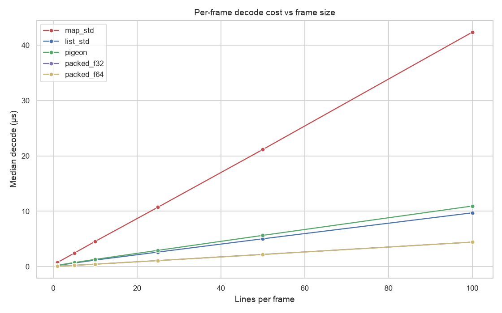
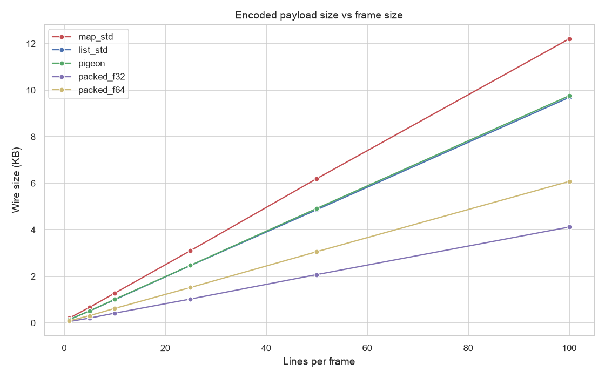
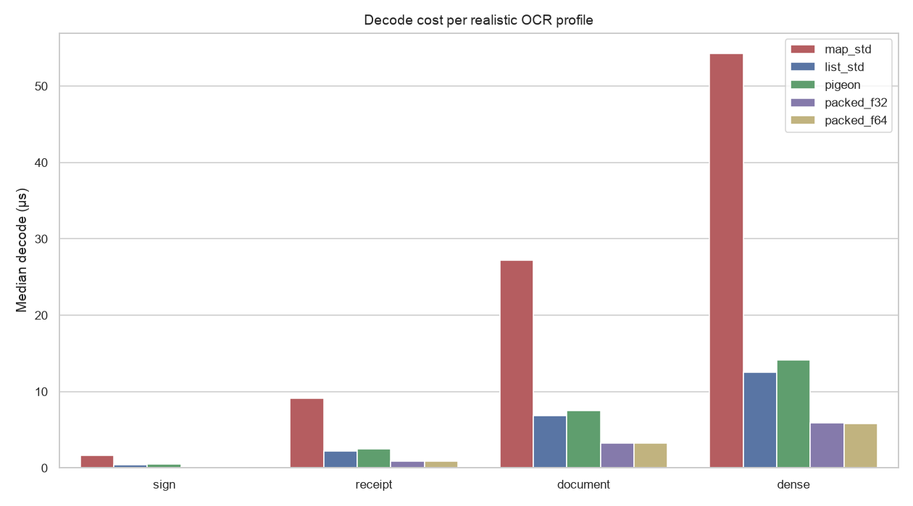

# Codec round-trip — state of performance

Per-frame **decode** CPU and **wire size** of the recognition-results transport, by candidate encoding. Decode is what runs on the Dart UI isolate per delivered frame; `map_std` is today's wire and the baseline.

> **Scope.** Pure-Dart codec cost only — *not* native encode, real-device frame latency, or ML inference (which dominates end-to-end). These numbers bound the upside of a transport change; they are not an end-to-end speedup.

Captured: SDK `3.13.2` · package `0.2.0` · git `ef8b8a4` · N=30 · 2026-09-01T13:33:21.079683Z · per-machine — your numbers will differ.

## Realistic profiles

| Profile | Candidate | Decode (µs) | Wire (bytes) | Δ decode | Δ bytes |
|---|---|--:|--:|--:|--:|
| sign | `map_std` | 1.61 | 432 | 0% | 0% |
| sign | `list_std` | 0.43 | 312 | -73% | -28% |
| sign | `pigeon` | 0.50 | 312 | -69% | -28% |
| sign | `packed_f32` | 0.14 | 116 | -91% | -73% |
| sign | `packed_f64` | 0.14 | 184 | -91% | -57% |
| receipt | `map_std` | 9.19 | 2608 | 0% | 0% |
| receipt | `list_std` | 2.24 | 2016 | -76% | -23% |
| receipt | `pigeon` | 2.50 | 2024 | -73% | -22% |
| receipt | `packed_f32` | 0.93 | 852 | -90% | -67% |
| receipt | `packed_f64` | 0.94 | 1280 | -90% | -51% |
| document | `map_std` | 27.32 | 9384 | 0% | 0% |
| document | `list_std` | 6.85 | 7648 | -75% | -18% |
| document | `pigeon` | 7.55 | 7704 | -72% | -18% |
| document | `packed_f32` | 3.45 | 4149 | -87% | -56% |
| document | `packed_f64` | 3.48 | 5417 | -87% | -42% |
| dense | `map_std` | 54.14 | 16496 | 0% | 0% |
| dense | `list_std` | 12.59 | 13136 | -77% | -20% |
| dense | `pigeon` | 14.14 | 13240 | -74% | -20% |
| dense | `packed_f32` | 6.21 | 6099 | -89% | -63% |
| dense | `packed_f64` | 6.23 | 8647 | -88% | -48% |

## Charts

