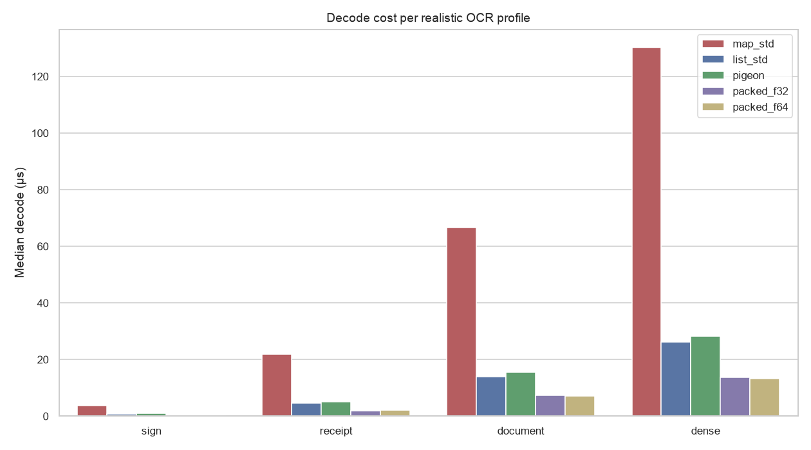

# Codec round-trip: state of performance

Per-frame **decode** CPU and **wire size** of the recognition-results transport, by candidate encoding. Decode is what runs on the Dart UI isolate per delivered frame. `map_std` is today's wire and the baseline.

> **Scope.** Pure-Dart codec cost only, *not* native encode, real-device frame latency, or ML inference (which dominates end-to-end). These numbers bound the upside of a transport change. They are not an end-to-end speedup.

Captured: SDK `3.13.2` · package `0.2.2` · git `bf2d478` · N=3 · 2026-09-06T13:36:13.693791Z. Measured on Android, so your hardware will differ.

## Realistic profiles

| Profile | Candidate | Decode (µs) | Wire (bytes) | Δ decode | Δ bytes |
|---|---|--:|--:|--:|--:|
| sign | `map_std` | 3.72 | 416 | 0% | 0% |
| sign | `list_std` | 0.78 | 296 | -79% | -29% |
| sign | `pigeon` | 0.86 | 304 | -77% | -27% |
| sign | `packed_f32` | 0.32 | 104 | -92% | -75% |
| sign | `packed_f64` | 0.32 | 172 | -92% | -59% |
| receipt | `map_std` | 21.77 | 2640 | 0% | 0% |
| receipt | `list_std` | 4.64 | 2056 | -79% | -22% |
| receipt | `pigeon` | 5.13 | 2072 | -76% | -22% |
| receipt | `packed_f32` | 1.98 | 847 | -91% | -68% |
| receipt | `packed_f64` | 2.12 | 1275 | -90% | -52% |
| document | `map_std` | 66.56 | 9256 | 0% | 0% |
| document | `list_std` | 13.96 | 7592 | -79% | -18% |
| document | `pigeon` | 15.52 | 7632 | -77% | -18% |
| document | `packed_f32` | 7.41 | 4003 | -89% | -57% |
| document | `packed_f64` | 7.09 | 5271 | -89% | -43% |
| dense | `map_std` | 130.07 | 16496 | 0% | 0% |
| dense | `list_std` | 26.09 | 13144 | -80% | -20% |
| dense | `pigeon` | 28.30 | 13296 | -78% | -19% |
| dense | `packed_f32` | 13.62 | 5963 | -90% | -64% |
| dense | `packed_f64` | 13.12 | 8511 | -90% | -48% |

Worst case measured: a `dense` 127-line frame on `map_std` decodes in 130.1 µs, which is 0.78% of a 60 fps frame.

## Charts

Not drawn, no data behind them:

- `decode_vs_lines.png` needs the sweep payload
- `wire_bytes_vs_lines.png` needs the sweep payload

